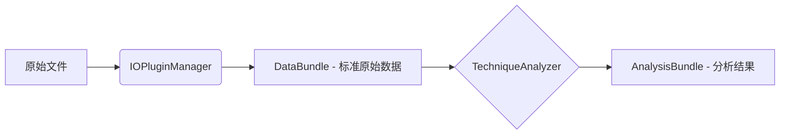

# echemistpy-cli

**电化学与材料表征的统一数据处理框架**

echemistpy-cli 旨在为电化学（Electrochemistry）和材料表征（XAS, STXM 等）数据提供一个统一、标准化且可扩展的处理接口。它使用 `xarray.Dataset/DataTree` 承载数据，并通过 `Metadata/DataBundle/AnalysisBundle` 统一传递数据、元数据和处理来源。

发行名使用 `echemistpy-cli`，Python 导入名保持为 `echemistpy`。

## 🌟 核心特性

- **多格式支持**: 自动识别并加载 Biologic (.mpt), LANHE (.xlsx), XAS (.dat), STXM (.hdf5) 等多种格式。
- **数据标准化**: 自动将不同仪器的列名和单位映射到统一标准（如 `Voltage/V`, `Current/mA`）。
- **多维数据**: 使用 `xarray.Dataset` 和 `DataTree` 处理复杂的时间序列和层级数据。
- **模块化分析**: 内置电化学分析（CV, GCD）和光谱分析（STXM, XAS）模块。

## 🚀 快速开始

### 安装

本项目使用 [uv](https://github.com/astral-sh/uv) 进行依赖管理。

1. **安装 uv** (如果尚未安装):
   ```bash
   pip install uv
   ```

2. **同步环境**:
   ```bash
   uv sync --all-groups --all-extras
   ```

### 使用示例

```python
from echemistpy.io import load

# 1. 自动检测格式加载
bundle = load("path/to/data.mpt", sample_name="MySample")

# 2. 访问数据 (xarray.Dataset 或 xarray.DataTree)
print(bundle.data)

# 3. 访问元数据
print(bundle.meta.to_dict())
```

## 🛠️ 开发指南

### 环境设置

```bash
# 安装开发依赖
uv sync --all-extras
```

### 代码质量检查

在提交代码前，请确保通过以下检查：

```bash
# 格式化代码
uv run ruff format src/

# Lint 检查与修复
uv run ruff check src/ --fix

# 类型检查
uv run ty check

# 运行测试
uv run --extra echem --extra test pytest
```

详细规范请参考 [AGENTS.md](AGENTS.md)。

## 🏗️ 架构概览



- **Metadata**: 标准元数据和仪器原始元数据容器。
- **DataBundle**: 标准原始数据包，包含 xarray 数据、元数据、schema、provenance 和 warnings。
- **AnalysisBundle**: 标准分析结果包，包含分析数据、元数据、schema、provenance、parameters 和 warnings。
- **TechniqueAnalyzer**: 特定技术（如 CV, STXM）的分析逻辑基类。
